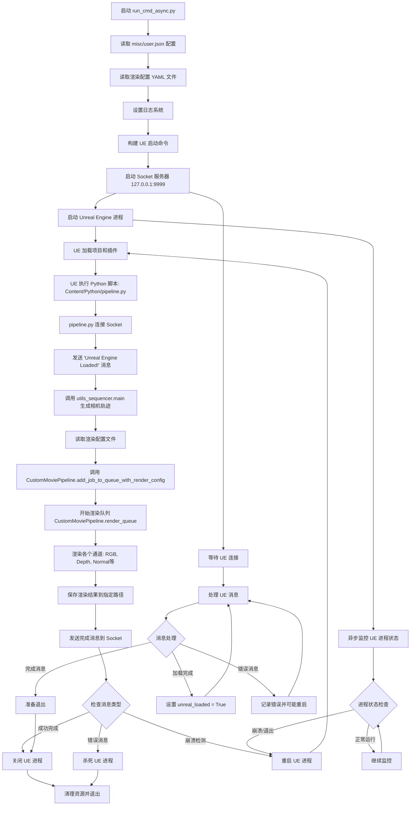

# MatrixCityPlugin 执行流程

## run_cmd_async.py 启动流程图

## MatrixCityPlugin 插件说明

### 插件概述
MatrixCityPlugin 是一个专为 Unreal Engine 5 设计的自动化渲染插件，主要用于城市场景的批量数据生成和神经渲染研究。该插件支持多通道渲染输出，可生成高质量的计算机视觉数据集。

### 主要功能
- **自动化渲染管线**: 支持批量渲染多种通道（RGB、深度、法线、金属度等）
- **相机轨迹生成**: 自动生成和管理相机运动轨迹
- **异步进程管理**: 稳定的 UE 进程监控和崩溃恢复机制
- **灵活配置系统**: 支持 YAML 配置文件和继承机制
- **Socket 通信**: 实时监控渲染进度和状态

### 目录结构

#### 1. 配置文件
- **`MatrixCityPlugin.uplugin`**: 插件主配置文件，定义插件依赖和模块
- **`misc/user.json`**: 用户配置文件，包含 UE 路径、项目路径、渲染配置等
- **`misc/render_config.yaml`**: 基础渲染配置文件
- **`misc/render_config_common.yaml`**: 通用渲染配置，继承自基础配置

#### 2. Python 脚本核心
- **`misc/run_cmd_async.py`**: 主启动脚本，异步管理 UE 进程和 Socket 通信
- **`Content/Python/pipeline.py`**: UE 内部执行的主管线脚本
- **`Content/Python/utils_sequencer.py`**: 相机轨迹和序列管理工具
- **`Content/Python/custom_movie_pipeline.py`**: 自定义电影渲染管线
- **`Content/Python/utils.py`**: 通用工具函数和装饰器
- **`misc/config.py`**: 配置文件解析和管理工具

#### 3. 资源文件
- **`Content/Materials/`**: 各种后处理材质，用于不同渲染通道
  - `PPM_basecolor.uasset`: 基础色通道材质
  - `PPM_depth_EXR.uasset`: 深度通道材质
  - `PPM_diffusecolor.uasset`: 漫反射通道材质
  - `PPM_metallic.uasset`: 金属度通道材质
  - `PPM_roughness.uasset`: 粗糙度通道材质
  - `PPM_specular.uasset`: 高光通道材质
- **`Content/Blueprints/`**: UE 蓝图资源
  - `BP_FunctionLibrary.uasset`: 功能库蓝图
  - `BP_SaveOptions.uasset`: 保存选项蓝图
- **`Source/`**: C++ 源代码，插件的底层实现

#### 4. 文档和工具
- **`docs/`**: 详细的使用文档
  - `Get-Started.md`: 快速开始指南
  - `Render-Data.md`: 渲染数据配置说明
  - `Generate-Trajectory.md`: 轨迹生成指南
  - `Export-Camera-Poses.md`: 相机姿态导出说明
- **`misc/`**: 辅助工具和配置
  - `email_sender.py`: 邮件通知工具
  - `vis_exr.py`: EXR 文件可视化工具
  - `visualize.py`: 数据可视化工具

### 使用方式
1. 配置 `misc/user.json` 文件，设置 UE 路径和项目路径
2. 修改 `misc/render_config_common.yaml` 配置渲染参数
3. 运行 `python misc/run_cmd_async.py` 启动渲染流程

### 支持的渲染通道
- **RGB**: 标准彩色图像
- **Depth**: 深度信息（EXR 格式）
- **Normal**: 法线贴图
- **Diffuse**: 漫反射颜色
- **Metallic**: 金属度信息
- **Roughness**: 粗糙度信息
- **Specular**: 高光信息
- **BaseColor**: 基础颜色

### 技术特点
- **异步架构**: 使用 asyncio 实现高效的并发处理
- **容错机制**: 自动检测和处理 UE 崩溃，支持自动重启
- **实时监控**: 通过 Socket 通信实时获取渲染状态
- **配置继承**: 支持 YAML 配置文件的层级继承
- **跨平台**: 支持 Windows 和 Linux 系统
