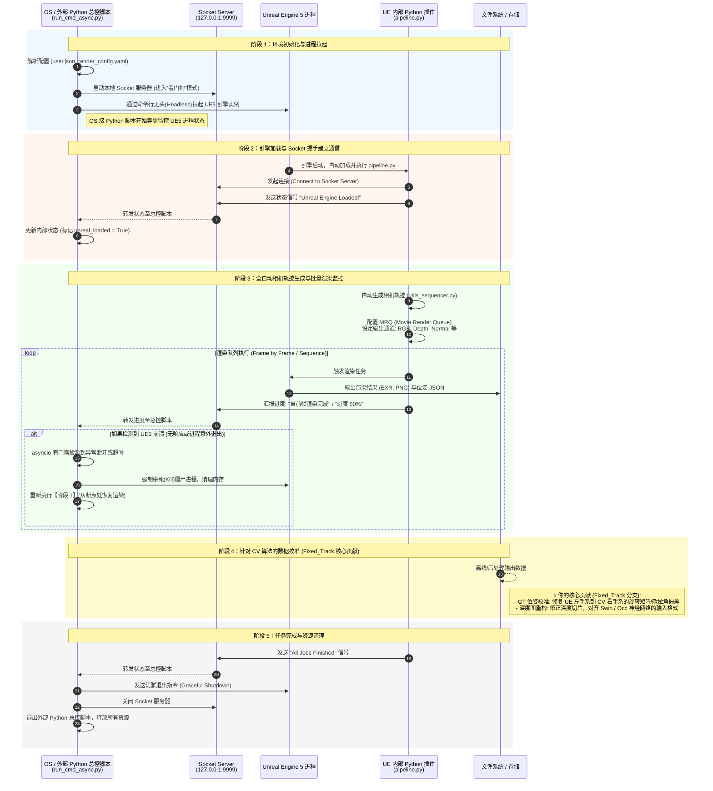

# UE5 自动化合成数据渲染管线架构图

这份文档详细展示了基于自定义 `MatrixCityPlugin` 插件的 UE5 自动化多模态数据生成管线架构。核心设计采用了**双进程架构**，并通过 **Socket 进行进程间通信 (IPC)**，确保了 CV (计算机视觉) 任务中数据生成的鲁棒性、自动化和高精度。

---

## 核心架构流程图

下面的 Mermaid 序列图展示了整个工作流的详细交互，重点突出了 OS 层面的控制脚本与 UE5 内部执行环境之间的职责分离，以及关键的 Socket 通信机制。

---

## PPT 演讲重点提炼：为什么要用 Socket 通信？

在向面试官展示这个流程图时，重点强调**双进程架构与 Socket 通信带来的工程价值**：

1. **解耦与稳定性 (Decoupling & Robustness):**
   *   UE5 作为一个庞大的 C++ 游戏引擎，在长时间、高负荷进行离线批量渲染时，难免会出现内存泄漏或偶发性崩溃（Crash）。
   *   如果把控制逻辑全写在 UE5 内部，引擎一崩溃，整个渲染任务就彻底挂了。
   *   通过分离出一个独立的 OS 级别 Python 脚本（`run_cmd_async.py`），它成为了一个极其稳定的“看门狗（Watchdog）”。

2. **实时状态感知 (Real-time State Monitoring):**
   *   两个进程之间如何对话？**Socket 就是它们的桥梁**。
   *   UE5 内部的 `pipeline.py` 像是一个打工仔，每做完一步（加载完成、生成轨迹、渲染完一帧），就通过 Socket 向外面的总管报告。
   *   总管不仅能记录进度，一旦发现 Socket 连接断开（说明引擎崩了），就能立刻触发异常处理逻辑：自动杀死卡死的进程，然后**断点续传**，重新拉起引擎接着上一帧继续渲染。这实现了真正的 7x24 小时无人值守。

3. **数据校准层（你的核心亮点）：**
   *   在图的第四阶段（黄色区域），着重强调原版插件产出的数据在导入 CV 网络（如占据网络 Occ）时，存在坐标系和深度的错配。你在 `Fixed_Track` 分支中通过严格的数学变换（旋转矩阵/深度投影修正），填补了渲染引擎和深度学习算法之间的鸿沟。